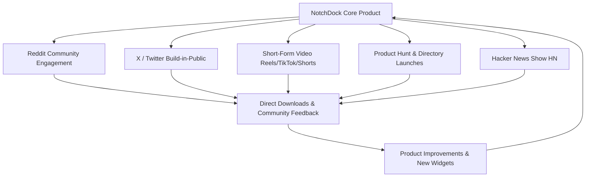

# NotchDock Multi-Channel Marketing Playbook

While Reddit is a core growth engine, long-term sustainable growth for an indie macOS app requires expanding across multiple high-leverage marketing channels.

---

## 1. Channel Overview & Growth Flywheel

---

## 2. Channel Playbooks

### 🚀 A. Product Hunt Launch
- **Target Timing**: Tuesdays or Thursdays at 12:01 AM PT.
- **Assets Needed**:
  - 1x High-contrast thumbnail (GIF showing smooth notch expansion).
  - 5x High-res gallery images showcasing key widgets:
    1. Hero: Dynamic notch expansion & surface interaction.
    2. Meeting Navigator: 1-click Join button + live countdown.
    3. Live Sports: ESPN linescore and live score pinning.
    4. Quick Notes: Apple Notes rich text sync.
    5. Stocks: Sparkline chart hover scrub.
  - Maker Comment: Explaining the inspiration, technical craftsmanship (Swift 6, 100% local, zero tracking), and special community launch offer.

---

### 🐦 B. X (Twitter) "Build in Public" & Video Demos
- **Audience**: Mac power users, designers, indie makers, Apple enthusiasts.
- **Content Types**:
  1. **Micro-video Demos (7–15 seconds)**: Screen recordings showing the mouse hovering into the notch, smooth 3D expansion, and 1-click meeting join.
  2. **"Before & After" Comparison**: Showing an overcrowded menu bar vs. a clean NotchDock setup.
  3. **Feature Changelogs / Sneak Peeks**: "Just shipped Apple Notes sync to the notch in Swift 6."
  4. **Engage with macOS / Tech influencers**: Quote-retweeting desk setup showcases or discussions around macOS notch utility.

---

### 📱 C. Short-Form Video (TikTok, Instagram Reels, YouTube Shorts)
- **High Virality Potential**: Mac aesthetic and desk setup videos perform exceptionally well on TikTok and Reels.
- **Video Concept 1**: *"3 Mac apps that feel like they were built by Apple"* (Feature NotchDock as #1).
- **Video Concept 2**: *"Did you know your MacBook notch can do this?"* (Hook: Hovering mouse into notch to reveal live football score or Zoom meeting join).
- **Video Concept 3**: *"Desktop Glow-Up: Replacing 5 ugly menu bar apps with one hidden tray."*

---

### 📰 D. Mac App Directories & Newsletters
Submit NotchDock to curated Mac software directories:
- **MacMenuBar.com**: High-intent directory for macOS menu bar and top-bar utilities.
- **Awesome-Mac (GitHub)**: Top-starred GitHub repository for curated macOS apps.
- **MacStories / Club MacStories**: Pitch to John Voorhees / Federico Viticci for Mac app roundup reviews.
- **BetaList & Uneed.best**: Early-stage product directories for indie software.
- **AlternativeTo**: Ensure NotchDock is listed as an alternative to Boring Notch, MediaMate, and DynamicLake.

---

### 💻 E. Hacker News (Show HN)
- **Format**: `Show HN: NotchDock – Local-only macOS Dynamic Island built in Swift 6`
- **What HN Cares About**:
  - **Technical details**: Native AppKit `NSPanel` overlay, EventKit integration, local AppleScript IPC, sandboxed architecture.
  - **Privacy**: No telemetry, no cloud backend, zero trackers, local-first.
  - **Performance**: <0.5% idle CPU, no Electron, purely native SwiftUI.
  - Be humble, open to constructive feedback, and active in the comment section for 24 hours.

---

### ⚽ F. Event-Driven & Trend Jacking Marketing
- **Major Match Days (Premier League / Champions League / NBA Finals)**: Post or tweet clip of the live match score pinned in the notch: *"Watching the match while pretending to work on my Mac."*
- **Apple Keynotes (WWDC / Mac Announcements)**: Join discussions regarding macOS features, window management, and notch design.
- **Earnings Season**: Showcase tracking NVDA/AAPL stock price directly in the notch during earnings call days.
